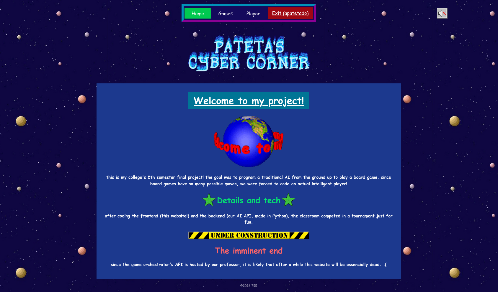
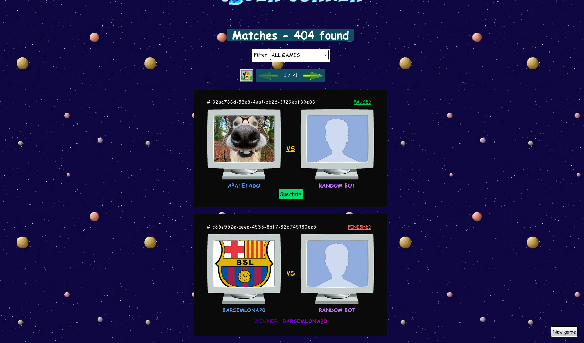
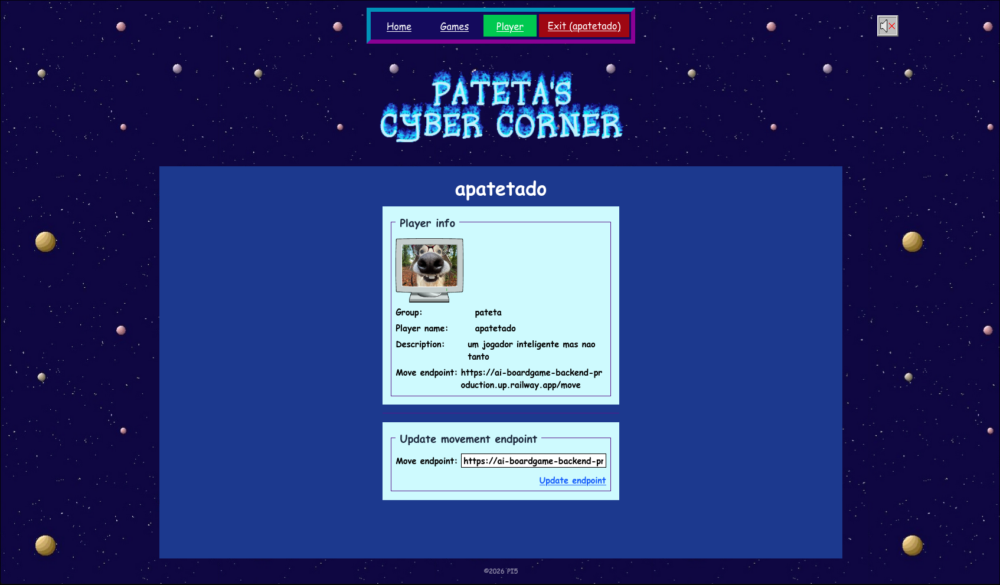
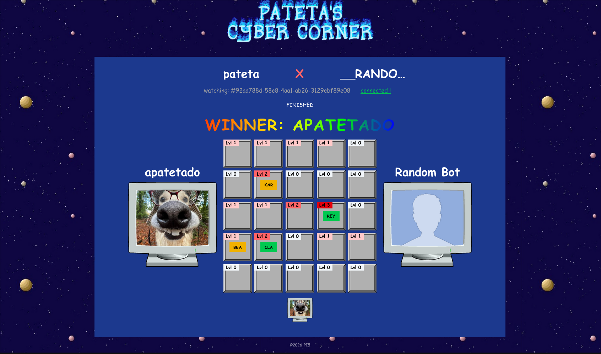

# AI boardgame player frontend

> this repo cointains the website that uses my professor's boardgame API to show, create and join matches using our backend bot!


## About

this is an app for my college's 5th semester, where the class competed by building traditional AI bots to play a boardgame. the boardgame's name was not revealed for the class!

this is a twin project alongside the [backend repo](https://github.com/joaoarapucas/ai-boardgame-backend). Here it is contained the web application that interacts with the game API, fetching games, players, etc.

## Tech and details

the website was made using React. The state of the game's board is fetched via websockets, and at the games list page the games are fetched using short polling: every 7 seconds, the site makes a request to list the games.

another feature is the use of the local storage: after registering or logging into a player, the auth token is saved to the local storage, so that the user doesn't need to log in everytime.

## File structure

| Folder        | Description                                     |
| :------------ | :---------------------------------------------- |
| `public`      | assets and items via direct URL                 |
| `src/assets`  | assets, data and other direct import stuff      |
| `src/core`    | Components, helpers, models and global types    |
| `src/feature` | App modules, encapsulated in features           |
| `src/routes`  | the website pages routes                        |
| `src/styles`  | simple styles for the website                   |
| `src/ui`      | some generic and reusable UI components         |

 ## Aesthetic

 the site is "ugly" on purpose! it is supposed to replicate the 2000s blogs era, especially the Geocities web pages.

 as such, it uses many animated gifs, basic HTML tags and rough color backgrounds. it even has a looping music that you can play/pause!

## Limitations and future improvements

because I was working part-time, had other college projects and was doing this all by myself, this sadly had some limitations! 

here are some improvements that should be noticed in this frontend:
- better data fetch states (errors and loading)
- better stylization in each component and page
- more decorations and animated gifs!

still, the site is fully functional and was made with a lot of effort and research.

## Inspirations

here's a list of some archives and websites that I used as references when making my own:
- Yahoo! Geocities
- [Cameron's World](https://www.cameronsworld.net/)
- [Retro website resources](https://fructisfans.neocities.org/Links)
- [a rummage bin](https://xixxii.neocities.org/gooftown/foryou)
- [cooltext](https://cooltext.com/)
- [GifCities](https://gifcities.org/search?q=loading&offset=0&page_size=200)
- [Betty's Graphics](https://bettysgraphics.neocities.org/webgraphics)
- [Hynospace Outlaw](https://store.steampowered.com/app/844590/Hypnospace_Outlaw/)
- [Mari's Carrd](https://marianawrs.carrd.co/)

## Gallery









# Running the site locally

## Requirements

- Node.js `v22` or greater

## Dependencies

- Vite
- React
- TypeScript
- React Router
- Tailwind

## How to execute

- Install the dependencies with you preferred package manager:
  ```sh
  npm install
  # OR
  pnpm install
  # OR
  yarn install
  # OR
  bun install
  ```
- Run the project:
  ```sh
  npm run dev
  # OR
  pnpm run dev
  # OR
  yarn dev
  # OR
  bun dev
  ```
- The project will be running in [`https://localhost:5173`](https://localhost:5173)
